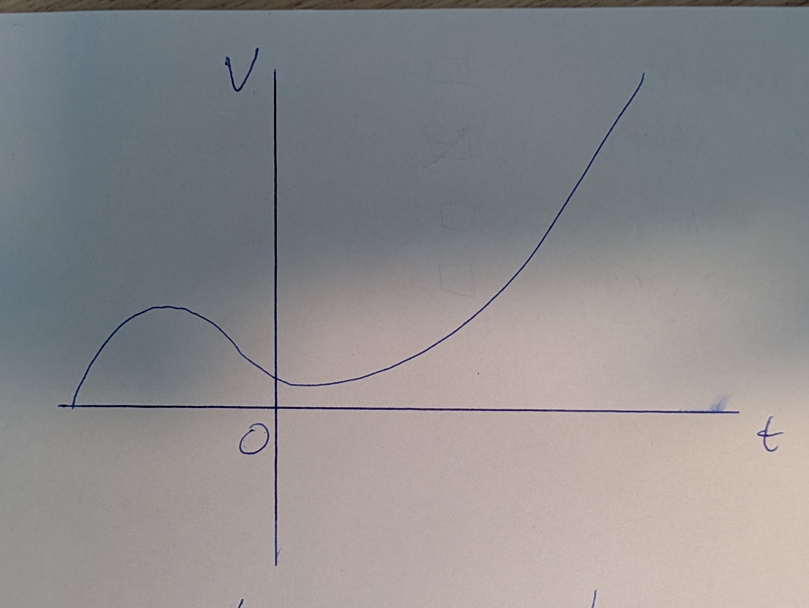

# 6. Grafiek plotten

We maken onderscheid tussen 3 manieren van het maken van een grafiek:
- Een grafiek schetsen
- Een grafiek tekenen
- Een grafiek plotten

## Een grafiek schetsen
Als wordt gevraagd om een grafiek te schetsen, dan hoef je alleen maar globaal de vorm van de grafiek in een assenstelsel te schetsen.

```{warning} Waar letten we dan op?
- De labels: bij de x-as, bij de y-as en de 0
- Dat het belangrijke deel van de grafiek is geschetst. Dus let altijd even op het verhaal bij de som welk deel je moet schetsen
```

```{note} Hoe weet je de vorm van de grafiek?
Hiervoor kan je de grafiek dus plotten in de GR! Zie hiervoor de beschrijving hier beneden.
```

## Een grafiek tekenen
Als je een grafiek moet tekenen, dan ga je (net als bijvoorbeeld bij het tekenen van een toenamediagram) eerst een tabel maken. In de tabel zet je een aantal punten die je hebt berekend. 
Daarna teken je het assenstelsel, met getallen op de assen met een constante assenverdeling (dus niet 1, 2, 5, 10), daarna teken je de punten in het assenstelsel en daar teken je een vloeiende lijn doorheen.

## Een grafiek plotten
Een grafiek plotten betekent dat je de grafiek in de GR gaat maken. Menno legt hieronder uit hoe je dit doet en wat voor opgave je hierbij kan krijgen. <br />
**Let op: je hoeft voor deze skill alleen de eerste 2 minuten en 57 seconden te kijken.**

```{iframe} https://www.youtube.com/embed/YOTnnHZcswE?si=vntctiqlDUb9YGes
```

### Maken vóór de instructie van maandag 19 mei
```{exercise} Voorbereidingsopgave 6

Er komt een nieuw spel op de markt. Deze kunnen klanten 4 weken voor uigifte pre-orderen. De fabrikant begint direct met het maken van de spellen, en begint ze na anderhalve week al te versturen over de wereld zodat ze op tijd geleverd kunnen worden. De fabrikant houdt de eigen voorraad van het spel bij en ontdekt dat dt volgens de volgende formule verloopt $V=t^3+2t^2-7t+7$ met t in weken.

Schets de grafiek hiervan vanaf het moment van spellen maken, tot 10 weken na de release datum.

```

```{solution} Voorbereidingsopgave 6
:class: dropdown

Voer in $y_1 = x^3 + 2x^2-7x+7$
 

```
