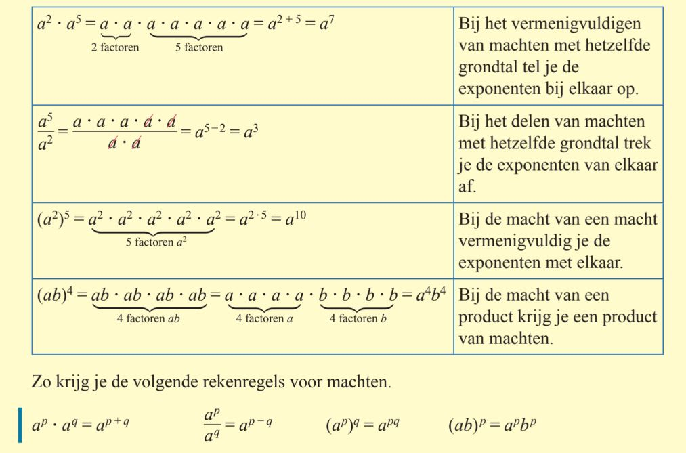
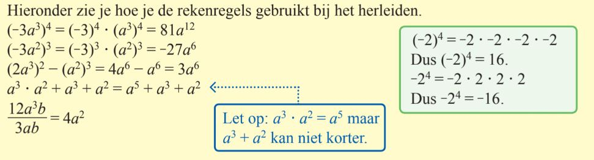

# 11. Machten vermenigvuldigen, delen en machtverheffen

Als we het hebben over 'machten' dan bedoelen we iets tot de macht een getal. Bijvoorbeeld $x^5$, en dus niet $5^x$. 

Je weet dat je $x^3$ en $x^2$ niet bij elkaar op kan tellen (dit blijft gewoon $x^3 + x^2$), maar wat gebeurt er als je machten gaat vermenigvuldigen, delen of zelfs een macht 'tot de macht iets' doet? Hiervoor hebben we vier rekenregels. Het boek legt deze regels goed uit in het volgende schema:

 

<br />

## Hoe werk je hiermee?
Sommige mensen lezen liever, en sommige kijken liever hoe Menno het doet. Je kan hier kiezen om naar een paar voorbeelden uit het boek, of naar Menno te kijken. Of je doet allebei. Hier zijn de voorbeelden uit het boek:

 

En hier is Menno die het stap voor stap voordoet:

```{iframe} https://www.youtube.com/embed/fApoa4z1G-U?si=zIqBx02G_kkiGD1S
```
