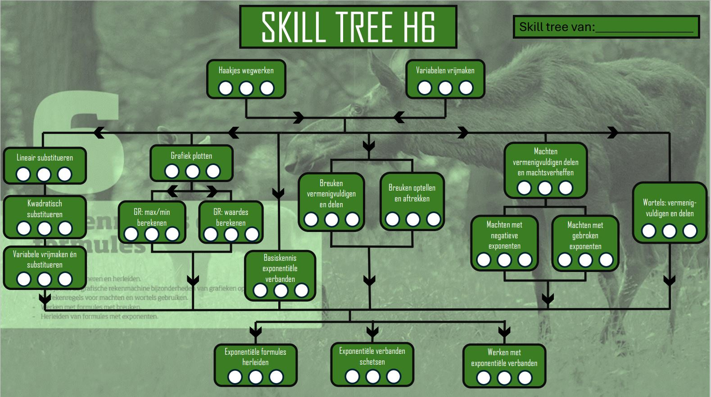

# Hoofdstuk 6

Op deze website staat alle uitleg, filmpjes en sommen van hoofdstuk 6 die belangrijk zijn om je Skill Tree te doorlopen.

## Skill Tree

 

## De skills op een rijtje

[1. Haakjes uitwerken](1.Haakjes_uitwerken.md)

[2. Variabele vrijmaken](2.Variabele_vrijmaken.md)

[3. Lineaier susbtitueren](3.Lineair_susbtitueren.md)

[4. Kwadratisch substitueren](4.Kwadratisch_substitueren.md)
